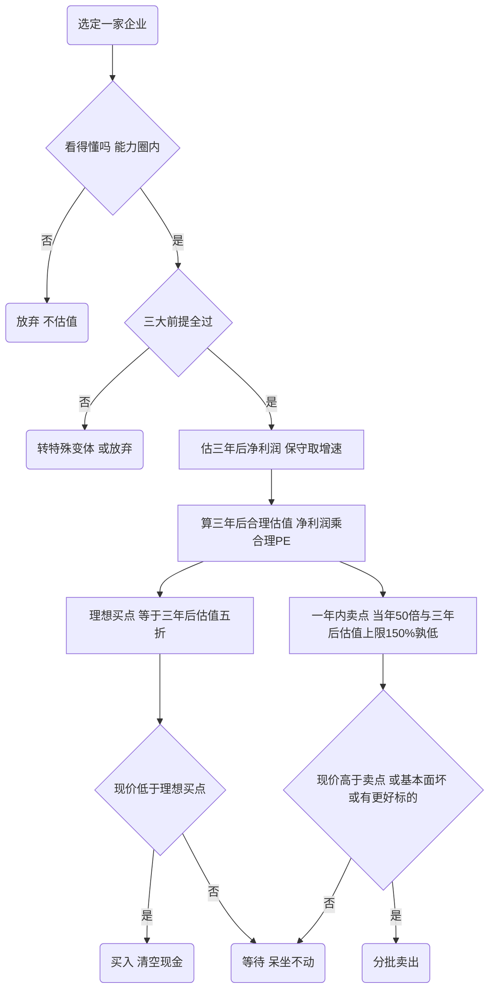

# 如何分析一家企业的内在价值（老唐估值法）

## 何时使用

当你需要回答以下任一问题时，按本 skill 的流程走：

- 这家公司值多少钱？内在价值大概是多少？
- 现在的股价能买吗？什么价位算便宜？什么价位该卖？
- 帮我用价值投资的方法研究/估值某家公司。

> **重要前置判断**：本方法**只适用于符合三大前提的优质企业**。银行、保险、地产、券商、航运、强周期、高资本开支、利润含金量低或有造假嫌疑的企业，**不能硬套本公式**。遇到这类企业，要么走"特殊企业变体"，要么诚实地说"这家不在老唐估值法的能力范围内"。

---

## 核心理念（先理解，再动手）

**1. 内在价值 = 企业未来全部自由现金流的折现值。** 这是逻辑上唯一正确的估值法（DCF），但不可精算。

> "自由现金流折现法是唯一能在逻辑上说得通的估值方法……一家企业值多少钱，要看从现在到它消失的全部时间段里，我能从中拿回多少钱，这些未来可以拿到的钱折合现在的钱是多少。"（老唐，2016）

**2. DCF 是思维方式，不是计算公式。** 不要去拉 Excel 做五阶段折现表。

> "DCF是个思维模式，不是一个计算方法。如果用它去做计算，不管用哪个数据，得到的都是精确的错误。"（老唐，2022）

**3. 把符合三大前提的好公司当成一份债券。** 自由现金流是票息，无风险收益率决定它值多少钱。

> "对于符合三大前提的企业，当年利润×25~30，是其当年的合理估值，其实也就是相当于将其直接视为一份债券。"（老唐，2021）

**4. 模糊的正确，好过精确的错误。** 先求方向（成长还是衰退）正确，再求数据接近。

> "首先求方向的正确，其次求数据的接近。即便退而求其次，数量差异不是很大，得到模糊的正确亦可。"（老唐，2018）

**5. 估值本质是"两种资产的比较"，而不是预测股价。** 合理估值只是一个"锚"，用来跟等值现金比较，看持有哪个更划算。

> "合理估值从来不是预测企业市值或股价会涨到这个数字去，它只是自己用来和等值现金做比较，比较持有哪个对我自己更划算的一个锚。"（老唐，2023）

---

## 第 0 步：圈定能力圈（只估你能看懂的）

估值的第一道闸门不是公式，而是"你看不看得懂这家企业"。A股 3500+ 家公司，真正敢下估值结论的最多几十家。

判断标准——你能否清楚回答这四个问题（看不懂就停，直接放弃）：

- [ ] 它靠卖什么商品/服务获利？
- [ ] 客户为什么选它而不选别家？
- [ ] 同样逐利的资本，为什么没有抢走它的利润 / 压低它的利润率？
- [ ] 同行或巨头挟巨资进来竞争，它能否保住甚至扩张份额？

> "有一尺高的栏，就别想着见栏就跳，这是所谓能力圈的核心要点。"（老唐，2016）

**只有四个问题都能踏实回答，才进入下一步。** 答不出来不代表公司不好，只代表它不在你的能力圈里。

---

## 第 1 步：三大前提排雷（不过关就不适用本方法）

这是整套方法的"排雷门槛"。**不符合三大前提的企业，本简化估值法不适用——这是硬约束，不是建议。**

> "25倍的前提是企业必须符合三大前提：利润为真；利润可持续；维持当前盈利能力所需新增资本投入很少甚至无需新增资本投入。"（老唐，2020）

### Checklist

- [ ] **前提一：利润为真** —— 赚的是真金白银，不是应收账款的欠条、关联交易或非主营偶然所得。
  - 判断方法：看**经营活动现金流净额**是否长期≈或≥净利润；看**应收账款**占比与增速是否异常；多年**持续真金白银分红**本身就是利润为真的佐证。
  - > "持续拿出真金白银来分红的行为本身，能够起到证明公司利润为真的作用。"（老唐，2016）

- [ ] **前提二：利润可持续** —— 未来利润能大体维持，至少能比当年高一点点；靠护城河支撑，不是昙花一现。
  - 判断方法：能否大体预测三年后的利润水平？盈利的来源是否有核心竞争力（护城河）撑着？强周期、靠单一政策/补贴、技术易被颠覆的，判否。
  - > "（利润可持续）至少能超过当年利润一点点。"（老唐，2021）

- [ ] **前提三：维持当前盈利能力不需要大量资本投入** —— 每年的折旧摊销足以维持现有盈利，赚到的钱大部分能分给股东而不伤元气。
  - 判断方法：长期看**资本性支出（购建固定资产/无形资产现金流出）是否长期≤折旧摊销**。若公司必须不断砸钱才能维持现有产能/利润（"吞金兽"），判否；像茅台这种"不需要投入更多资本就能成长的印钞机"，判是。
  - > "维持当前盈利能力不需要大量资本投入，可理解为每年的折旧摊销足够满足维持当前盈利能力所需的资本投入。"（老唐，2022）

**三条全过 → 进入估值。任何一条不过 → 停，转"特殊企业变体"或放弃。**

---

## 第 2 步：定性研究（决定给多少倍、要多大折扣）

三大前提是"能不能用"，定性研究是"用多保守"。重点考察四件事：

- **护城河 / 长期竞争优势**：护城河越宽、且未来还会变宽 → 合理市盈率取偏上限（30倍）；护城河一般 → 取偏下限（25倍甚至更低）。持续高 ROE 通常意味着存在某种护城河。
- **确定性**：你对企业理解越深、未来变量越少、假设越悲观 → 安全边际要求越低、仓位可越重；反之越要等到打更深折扣才下手。
  > "确定性越高、未来变量越少、所做假设越悲观、自己研究越深入的企业，对安全边际的要求越低。"（老唐，2021）
- **利润含金量**：自由现金流占净利润的比例。含金量 100% → 净利润可直接当自由现金流；只有 80% → 估值时把净利润打八折（见第 3 步）。这是对盈利**质量**的判断，不是对估值水平的调整。
- **管理层能力与诚信**：要么选优秀且诚信的管理层，要么选管理层影响不大的生意。看到大谈"情怀"的，提高警惕。

---

## 第 3 步：定量估值（核心公式）

整套估值**只有一个未知数：企业三年后的净利润**。其余都是死板规则。

### 3.1 合理市盈率 = 1 / 无风险收益率

不区分行业、不参考个股历史市盈率，只看无风险收益率。

> "在All cash is equal的原则下，对于符合三大前提的企业，不区分行业特色，不区分历史波动区间，一律以无风险收益率的倒数作为三年后合理估值的市盈率水平。"（老唐，2020）

| 无风险收益率 | 合理市盈率（=倒数） | 备注 |
|---|---|---|
| 3% ~ 4% | **25 ~ 30 倍** | 当前常态；25是区间下沿，30是上限 |
| 4% ~ 5% | 20 ~ 25 倍 | |
| 5% ~ 6% | **15 ~ 20 倍** | 利率高时只给这么多 |

- **上限封顶**：无论利率多低（哪怕零利率/负利率），合理市盈率**不超过 30 倍**——这是安全边际的体现。30倍只给确定性极高的极少数企业（历史上仅茅台、腾讯）。
  > "无论如何，当下的合理估值对应的市盈率都不能 > 1/无风险收益率……这是老唐估值法所能承受的极限。"（老唐，2021）
- **无风险收益率怎么取**：取十年期国债收益率或 AAA 级企业债收益率；简便做法是在货币基金/银行保本理财收益率上加一点点，**不必精确，大略即可**。

### 3.2 自由现金流 ≈ 净利润（适用条件与例外）

- **符合三大前提时**：直接用报表净利润替代自由现金流。原理是假设每年折旧摊销刚好覆盖维持性资本支出。
  > "我一般寻找净利润含金量100%或近于100%的企业，所以用净利润直接替代自由现金流。"（老唐，2018）
- **含金量略有瑕疵时**：把净利润打折后再当自由现金流。例：含金量约 80% → `25 × 80% = 20`，即用 20 倍。
  > "对净利润予以折扣处理。体现在速算中就是取稍低的市盈率，即 1×80%×25 = 1×20。"（老唐，2020）
- **例外（自由现金流 > 净利润）**：极少数企业（如茅台靠预收款），自由现金流长期大于报表净利润，才可把倍数上调到 25~30 区间的上沿。
- **不适用**：重资产高资本开支企业（如海螺水泥），净利润 ≠ 自由现金流，不能简单替代，需另行分拆估值。

### 3.3 两个合理估值

```
当年合理估值   = 当年（预估）净利润   × 合理市盈率(25~30)
三年后合理估值 = 三年后预估净利润     × 合理市盈率(25~30)
```

- 三年后净利润 = 当年净利润 × (1 + 预期年增速)³。**预期增速务必保守**，老唐几乎不采纳超过 25% 的增速；优质企业一般取 10%~15%。
- 合理估值是一个**区间**，通常写成"某值 ± 10%"，区间上限用于算卖点。
- 老唐本人偏好直接算"三年后合理估值"，跳过当年合理估值。

> "理想买点=三年后合理估值的50%。当年合理估值=当年自有现金（符合三大前提的企业可以用净利润替代……）×25~30。这里的25~30指的是无风险收益率的倒数。"（老唐，2021）

---

## 第 4 步：买卖点决策

### 4.1 理想买点 = 三年后合理估值 × 50%（打五折 / 拦腰一刀）

打五折对应"未来三年赚一倍（三年翻倍，年化约 26%）"，**同时内含了成长因素与安全边际**——这是这个公式里两件事一起完成的关键。

> "理想买点是三年后合理估值的50%，是考虑了未来三年的成长因素并预留了安全边际。"（老唐，2021）

- **买入区间**：从"当年合理估值之下"开始关注，到"理想买点（三年后估值50%）"清空现金买满。
- 当年合理估值到理想买点之间买多少，取决于你对确定性的把握和对波动的承受力——确定性越高越敢在合理估值之下就买。

### 4.2 一年内卖点 = 二者孰低

```
一年内卖点 = min( 当年净利润 × 50倍 ,  三年后合理估值上限 × 150% )
```

> "①当年动态市盈率50倍对应的市值，vs ②三年后合理估值×150%，①和②两个数据比较，哪个小取值哪个。"（老唐，2023）

- 注意是三年后合理估值的**上限** × 150%（体现"尽量不卖"）。
- 含金量不高的企业，50 倍那一项可再打八折。
- **关键提醒**：卖点不是"股价会涨到这里"的预测，只是"涨到这里就明显高估、该把股权换成现金"的纪律线。

### 4.3 卖出三大理由

只在以下三种情况卖（外加"急等用钱"这一现实动因）：

1. **相对内在价值明显高估**（到达卖点：当年 50 倍或三年后估值 150%，纵向跟自己比）。
2. **基本面恶化 / 企业变坏**（核心逻辑被破坏，则及时斩仓，无论腰斩还是脚踝斩）。
3. **有更好的标的**（横向比较，换成性价比更高的资产）。

> "卖出，无外乎三条，过度高估，企业变坏，有更好目标。"（老唐，2018）

**默认倾向是"尽量不卖"**：除非明显高估逼你不得不持有现金，否则尽量站在优质企业的股权里，做时间的朋友。

### 决策流程



---

## 特殊企业变体（不符合三大前提时）

### 周期股（盈利大起大落、看不清三年后）

用**席勒市盈率法**：以过去十年净利润的平均值作"正常产出/正常利润"，替代当年净利润。

```
合理估值     = 过去十年平均净利润 × 合理市盈率(25~30)
理想买点     = 当年合理估值 × 70%   （打七折，不是五折）
一年内卖点   = 当年合理估值上限 × 150%
```

> "当年合理估值的7折买入，合理估值上限的150%卖出（因判断不了三年，故借用当年合理估值数据）。"（老唐，2020）

- 七折的来历：格雷厄姆的"对折"提升为"七折"；数学上 ≈ 假设 12% 增长下三年后估值打五折的简化。
- 更保守时，可把十年平均净利润再打八折当自由现金流（处理周期股的资本支出）。
- **采用席勒市盈率法的企业，不再估算"三年后估值"**，只用当年口径。
- 自陈：周期股估值"最终是否有效，老唐心中也没底"，仓位不宜高。

### 高杠杆企业（有息负债 / 总资产 > 70%）

在标准结论上**打七折**（买点更苛刻），因为高杠杆对宏观与意外更脆弱，需要更高风险溢价。

> "打七折的意思指对于高杠杆企业，要求三年后以10.5倍市盈率（简化为10倍）卖出就能赚100%时，才会考虑。"（老唐，2018）

### 类金融 / 重资产 / 含金量过低

银行、保险、地产、券商，以及利润含金量低于 70%、无法确认利润为真、或净利润远不等于自由现金流的企业——**直接判定"不在老唐估值法适用范围"**，不要硬套 25 倍。重资产但优质的（如海螺）需把净利润分拆成现金分红 / 资本支出 / 留存三部分单独估值，已超出本简化法。

---

## 完整算例

**自拟公司"稳赚股份"**（虚构，仅演示流程）：

- 能力圈：看得懂，四个问题都能答 ✓
- 三大前提：经营现金流净额≈净利润（利润为真 ✓）；有品牌护城河、利润可持续 ✓；资本开支长期低于折旧 ✓ → **全过，适用本方法**
- 当年（第 0 年）净利润：**20 亿**
- 保守预期年增速：**12%**（优质企业的合理增速）
- 当前无风险收益率：**3.5%** → 合理市盈率取 **25~30 倍**（用中值便于演示，区间见下）
- 含金量 100% → 净利润直接当自由现金流

**Step 1　三年后净利润**
```
20 × (1 + 12%)³ = 20 × 1.4049 ≈ 28.1 亿
```

**Step 2　当年合理估值**（参考用）
```
20 × 25 = 500 亿   （下沿）
20 × 30 = 600 亿   （上限）
→ 当年合理估值 ≈ 550 亿 ± 10%
```

**Step 3　三年后合理估值**
```
28.1 × 25 = 702 亿   （下沿）
28.1 × 30 = 843 亿   （上限）
→ 三年后合理估值 ≈ 770 亿 ± 10%（下沿702 / 上限843）
```

**Step 4　理想买点 = 三年后合理估值 × 50%**
```
取下沿更保守：702 × 50% ≈ 351 亿
（即现价 ≤ 约 350 亿时，开始清空现金买满）
```

**Step 5　一年内卖点 = 二者孰低**
```
① 当年净利润 × 50倍       = 20 × 50  = 1000 亿
② 三年后合理估值上限×150% = 843 × 150% ≈ 1265 亿
→ 取较低者 = 1000 亿
```

**结论（一句话）**：稳赚股份现价低于约 350 亿就值得买入、买满；市值涨到约 1000 亿就到了一年内卖点，可分批减仓；350~1000 亿之间呆坐不动，不买不卖（除非基本面恶化或出现更好标的）。

---

## 常见误区

- **把不符合三大前提的企业硬套 25 倍。** 银行/保险/强周期/高资本开支套了就是"精确的错误"。先排雷，再估值。
- **去精算 DCF（拉五阶段折现表、纠结永续增长率）。** DCF 是思维方式不是计算器，取数稍变结果天差地别，容易"屁股决定大脑"。
- **跳过能力圈直接算。** 看不懂还估值，等于给一个你不理解的黑箱贴价签。
- **用错市盈率口径。** 合理市盈率只由无风险收益率决定，跟"市场给它历史 50 倍还是 8 倍"无关。别拿行业平均 PE 当锚。
- **增速取得太乐观。** 几乎不采纳 >25% 的增速；高增速会把买点抬得很高，吞掉安全边际。
- **把卖点当涨幅预测。** 卖点是"高估该换现金"的纪律线，不是"股价一定会涨到这里"的承诺。
- **含金量不足却用满倍数。** 含金量 80% 就该用 20 倍（25×80%），不是 25 倍。
- **在合理估值就急着买满。** 理想买点是三年后估值的 50%；合理估值到买点之间是"可个性化处理"区，不是"必须买满"区。

---

## 方法的局限与告诫（老唐自陈）

- **估值是模糊判断，不是精算。** 内在价值"是且只能是一个模糊的区间数字"，试图算到小数点后去指导窄幅高抛低吸是徒劳的。
  > "精确到小数点后的所谓估值，都是逗你玩儿。"（老唐，2016）
- **只预测三年（3~5 年为宜）。** 超过三年的预测正确率低于 50%，所以滚动看三年、不断修正，而不是预测十年。
- **安全边际来自"打折"，不来自"算得准"。** 几乎肯定会估错，靠对折买入（成长 + 折扣）来吸收错误。
  > "这就是估值要保守，同时买入价还要在合理估值基础上打对折的原因：因为我们有可能会错。"（老唐，2019）
- **会错过超高成长股。** 对年化 >30% 的企业，本方法给的估值偏低，会系统性错过那些真做到超高成长、市场又从不给低估值的公司——这是方法的固有缺陷，认了。
- **准确估值是整个体系里最不重要的部分。** 真正决定长期收益的是企业分析（能力圈）和对市场波动的态度，而非把估值算到几分几毛。
  > "我心中的估值中枢只随无风险收益率的变化而变。这是我从股市里赚到几千万的核心秘诀。"（老唐，2022）

---

## 出处与演变

- **2016（奠基）**：用《聊聊估值》系列确立"内在价值 = 全生命周期自由现金流折现"，定调"DCF 是思维模型不是计算方法"、"股票是一种特殊的债券"；此时尚无"老唐估值法"之名，三大前提与五折买点公式尚未成形。
- **2018（定名 + 系统化）**：正式命名"**老唐估值法**"，明确"合理市盈率 = 1/无风险收益率"、"三年后合理估值 × 50% = 买点"、"高杠杆打七折"、30 倍上限仅限茅台/腾讯。
- **2019（手册化）**：《价值投资实战手册》出版，首次给出"合理估值"概括语，区分"一年内卖点"与"三年后估值 150%"两套卖出标准。
- **2020（三大前提 + 理想买点定型）**：把表格"老唐买点"正式更名为"**理想买点**"，系统化周期股席勒市盈率法（七折/十年正常利润），明确"一年内卖点 = 50 倍与 150% 孰低"。
- **2021–2022（体系闭环）**：《投资的底层逻辑》与《价投手册第二辑》把"股票是特殊债券 → 三大前提 → 合理 PE = 1/无风险收益率 → 五折买点 → 孰低卖点"串成完整链条，提出"估值八大核心要点"。
- **2023（利率自适应）**：明确合理倍数随无风险收益率下行而上调（早年 5~6% 利率给 15 倍，利率降到 3%+ 才给 25 倍），并再次强调"准确估值是整个体系中最不重要的部分"。
